# Discord chess assistant
### Requirements:
Discord bot - generate bot with your discord account and acquire a token  
Lichess account - sign up on lichess and acquire a API token
### Installation
Create a file "config.js" in settings directory and paste there name of the file with intents, discord and lichess tokens. it should look like this:  

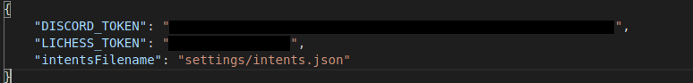

Add your bot to your discord server. Run bot.py file. It will install necessary data from nltk (If it is not already installed).

### Intents
* <a href="#1">Welcoming messages</a>
* <a href="#2">Goodbye messages</a>
* <a href="#3">Repeadting a message</a>
* <a href="#4">Asking about current time </a>
* <a href="#5">Telling a interesting chess fact</a>
* <a href="#6">Asking about world chess champion</a>
* <a href="#7">Asking about top chess players on lichess.com</a>
* <a href="#8">Telling player's rating</a>
* <a href="#9">Telling how many games have been played on this account</a>
* <a href="#10">Challenging a player</a>
* <a href="#11">Creating a tournament</a>
* <a href="#12">Joining a team </a>

#### Welcoming messages

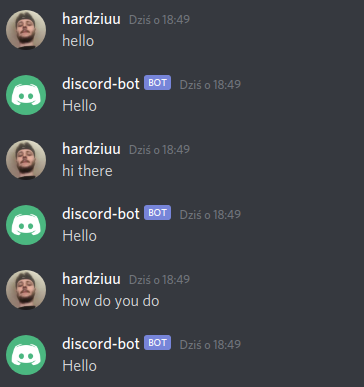

#### Goodbye messages

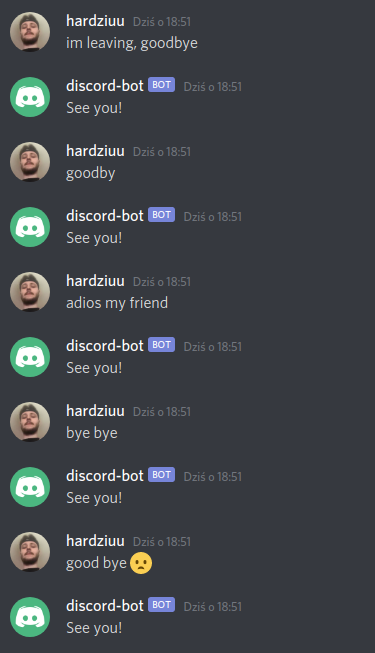

#### Repeating a message

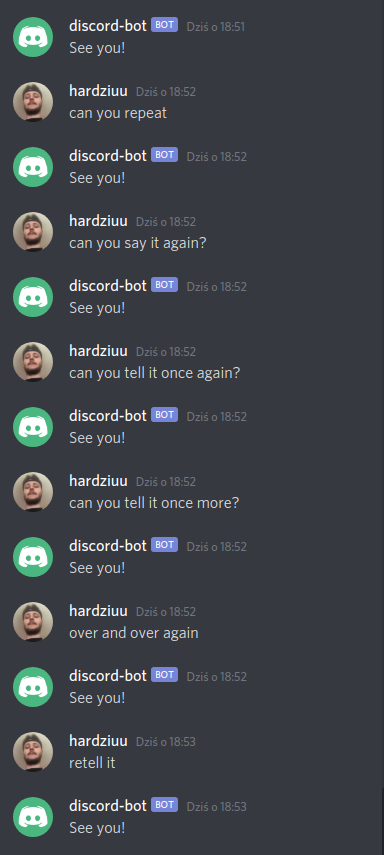

#### Asking about current time 

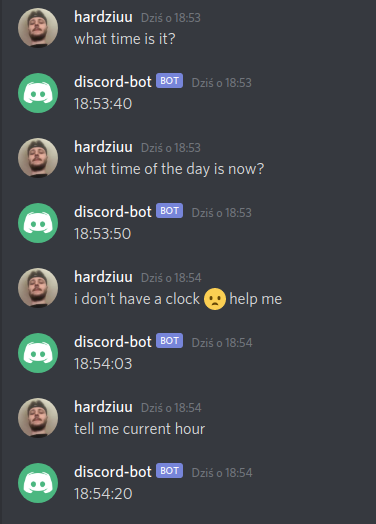

#### Telling a interesting chess fact
Facts are hard-coded and picked randomly.

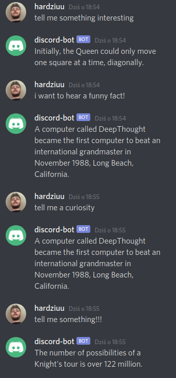

#### Asking about world chess champion

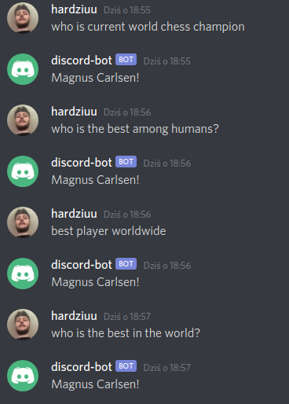

#### Asking about top chess players on lichess.com
Fetch top 10 rapid players from lichess api.

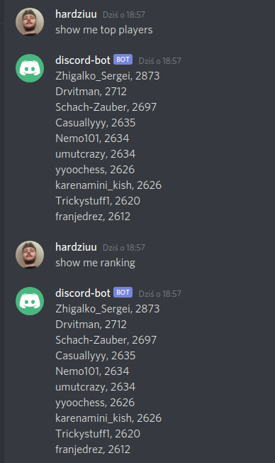

#### Telling player's rating
Fetch own rating from lichess api.

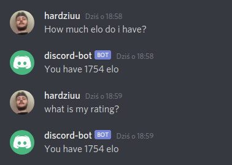

#### Telling how many games have been played on this account
Fetch rapid games amount from lichess api.

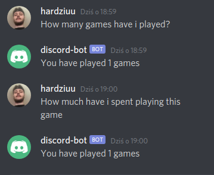

#### Challenging a player
Create a challenge using lichess api.

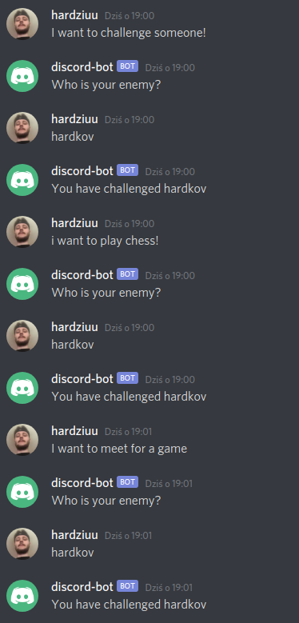
  
Challenge created:  

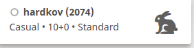

#### Creating a tournament
Create a tournament using lichess api.

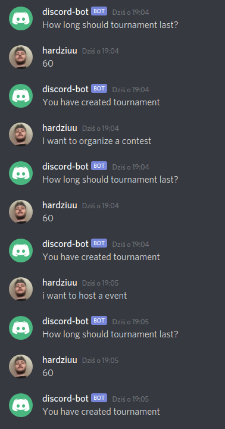

Tournament created:  

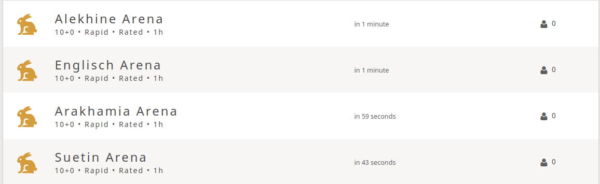

#### Joining a team 
Join a team using lichess api.

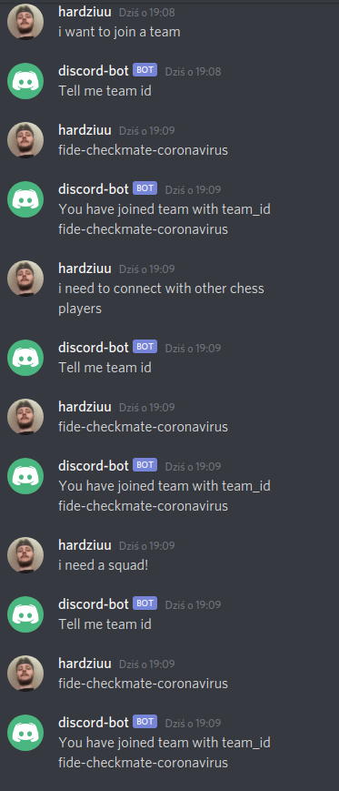

Joined a team:  

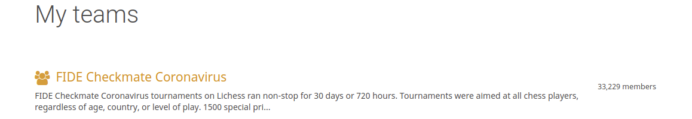

